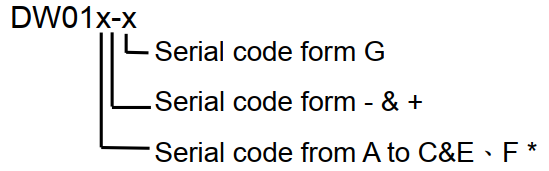
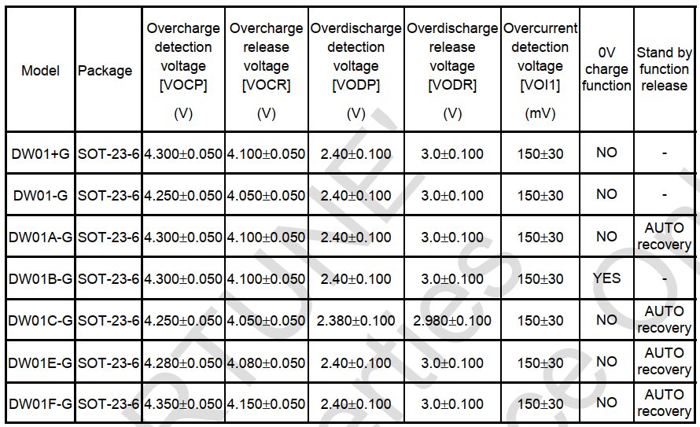
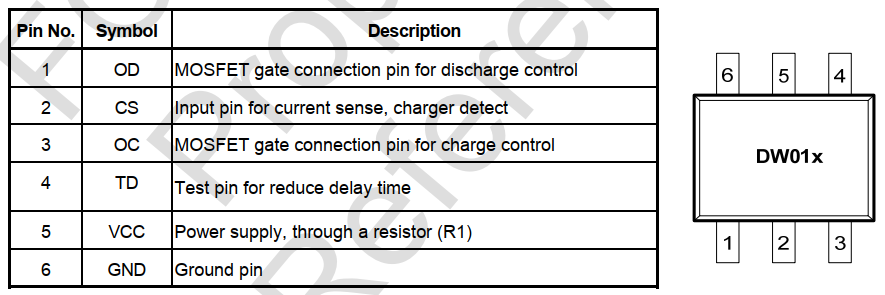
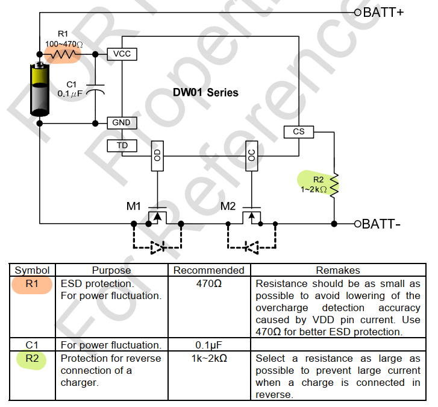
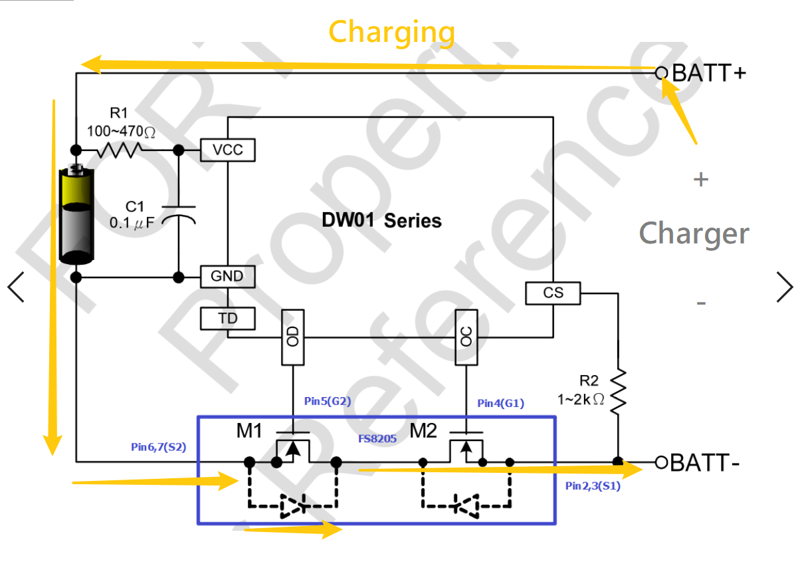
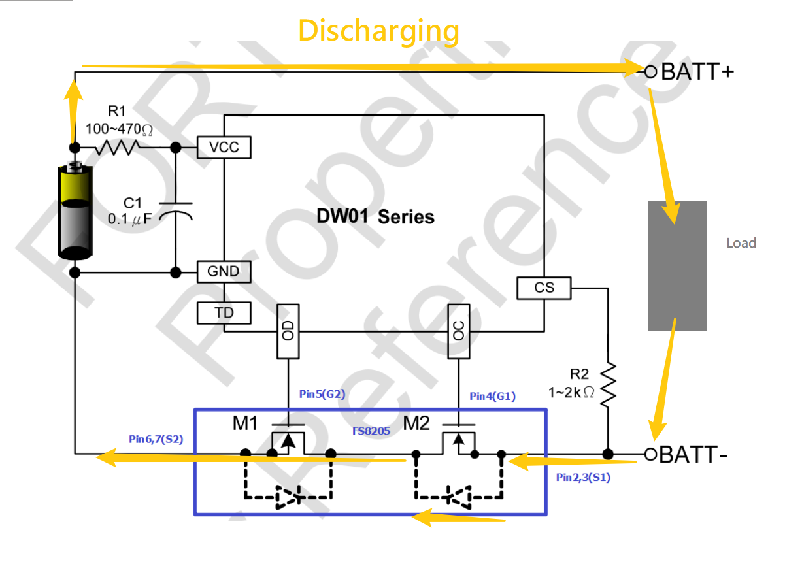
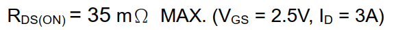
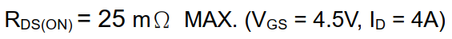
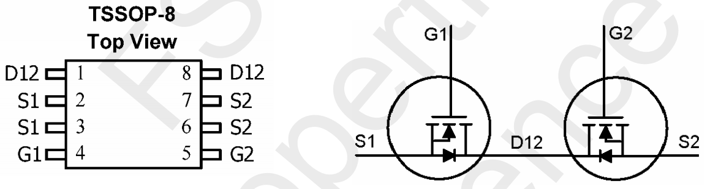
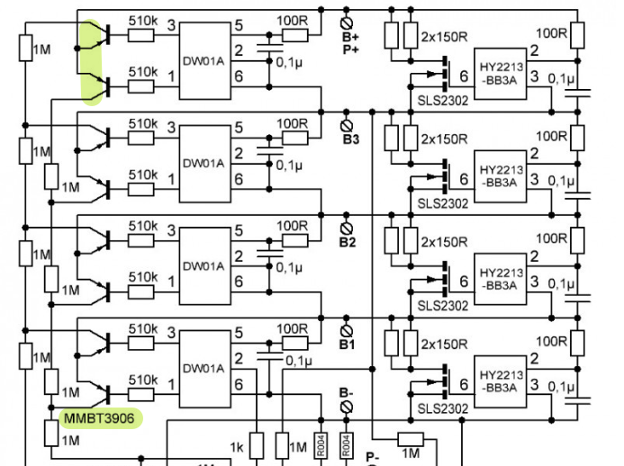

## 设计板子需要具备的功能

[toc]

过放保护功能

过充保护功能

单元均衡功能

过温保护功能

过流保护功能

短路保护功能

## 对标分析

DW01 方案特点

利用单节保护的 DW01进行堆叠， 可以实现同一平台 4-16串的通用， mosfet 可以根据标称电压选择

常发 CF-16SJH-B

https://detail.1688.com/offer/539894049660.html

功能

- **4**-13串通用，无需改线可直接降级使用。
- 将功能分为三大部分（串数，耐压， 均衡功能），三大部分均可配置生产，是平台生产的典范
- 同口分口（分口默认 8A 充电电流）

外观分析

MOSFET： RU7088R

疑问

为什么这些商用板子都故意将正面（MOS）遮住不放出来。

价格如果批量的话在 32-36之间

产品参数表

|              | 详细内容               | 规格           | 单位   | 备注       |
| ------------ | ---------------------- | -------------- | ------ | ---------- |
| 放电         | **持续放电电流**       | **≤20**        | **A**  |            |
|              | 瞬间放电电流           | 100            | A      |            |
| 充电         | 充电电压               | 54.6           | V      |            |
|              | **充电电流**           | **20（MAX）**  | **A**  |            |
| 过充电保护   | **过充电检测电压**     | **4.28±0.05**  | **V**  |            |
|              | 过充电保护延时         | 100            | mS     |            |
|              | 过充电解除电压         | 4.08±0.05      | V      |            |
| **电量平衡** | **电量平衡检测电压**   | **4.20±0.025** | **V**  |            |
|              | **电量平衡解除电压**   | **4.20±0.05**  | **V**  |            |
|              | **电量平衡电流**       | **45±5**       | **mA** |            |
| 过放电保护   | **过放电检测电压**     | **2.55±0.08**  | **V**  |            |
|              | 过放电检测延时         | 50             | mS     |            |
|              | 过放电解除电压         | 3.0±0.1        | V      |            |
| 过电流保护   | 过电流检测电压         | 150            | mV     |            |
|              | 过电流检测延时         | 15             | mS     |            |
|              | **过电流保护电流**     | **120±20**     | **A**  |            |
|              | 过电流保护解除条件     | 断开负载       |        |            |
| 短路保护     | 短路保护条件           | 外部负载短路   |        |            |
|              | 短路检测延时           | 200            | uS     |            |
|              | 短路保护解除条件       | 断开负开       |        |            |
| 温度保护     | 温度保护               | /              | ℃      | **可设定** |
| 内阻         | 主回路导通内阻         | ≤15            | mΩ     |            |
| 自耗电       | 工作电流               | ≤50            | uA     |            |
|              | 睡眠电流（电池过放时） | ≤10            | uA     |            |
| 工作温度     | 温度范围               | -30/+80        | ℃      |            |

嘉百达 JBD-HP24SA（可以买一块回来）

https://item.taobao.com/item.htm?spm=a21wu.10013406.0.0.c72956bb0uTdY8&id=35436579400

感觉做的很好的一块板子

https://item.taobao.com/item.htm?spm=a21wu.10013406.0.0.c72956bb0uTdY8&id=568098909985

## 调研部分

DW01 是低端商用 PCM 常用的采样芯片，优势劣势都非常明显。

### DW01x 的各个型号的区别

#### 命名规则

#### 参数表/选型表

#### 引脚信息

#### 典型应用

#### DW01 的工作原理

此 DW01 持续侦测连接在 VDD 和 GND 之间的电池电压，以及 CS 与 GND 之间的电压差，来控制充电和放电。

##### 正常工作

当电池电压在过放电检测电压（VODP）以上并在过充电检测电压（VOCP）以下，且 CS 端子电压在充电器检测电压（VCH）以上并在放电过流检测电压（VOI1）以下时：**IC 的 OC 和 OD 端子都输出高电平，使充电控制用 MOS 管和放电控制用 MOS 管同时导通，这个状态称为“正常工作状态”。此状态下，充电和放电都可以自由进行。**

正常工作时，OD 和 OC 是同时输出高电平，2个 MOS 同时导通。具体原理如下：
在充电状态时，是 M1 的 G 极跟 S 极 DS 间的寄生二极管形成回路产生电压差，M1 导通

在放电状态时，OD 和 OC 也是同时输出高电平，是 M2 的 G 极跟 S 极与 DS 间的寄生二极管形成回路产生电压差，M2 导通

##### 过充电保护

当电池电压高于过充电保护电压(VOCP)并超过过充电延时时间(TOC)周期，充电动作将通过关断充电控制 MOS 管（OC）被禁止。**过充电延时时间默认为 80 ms**。当电池经过放电使电压低于过充电释放电压(VOCR)，过充电保护情形将立即解除。

##### 过放电保护

当电池电压低于过放电保护电压(VODP) 并超过过放电延时时间(TOD)周期，放电动作将通过关断放电控制 MOS 管（OD）被禁止。**过放电延时时间默认为 40 ms**。 当电池经过充电使电压高于过放电释放电压(VODR)，过放电保护情形将立即解除。

It's not a straight forward value. the voltage across the dw01 CS sense resistor R2, typically 1k ohm determines when the over current triggers. The voltage at CS rises based on the current draw through the battery internal resistance and the control mosfet chosen. Basically the ground voltage at CS will rise as the current increases. See the datasheet for these two sections:

> Overcurrent Protection
> In normal mode, the DW01-P continuously monitors the discharge current by sensing the voltage of CS pin. If the voltage of CS pin exceeds the overcurrent protection voltage (VOIP) beyond the overcurrent delay time (TOI1) period, the overcurrent protection circuit operates and discharging is inhibited by turning off the discharge control MOSFET. The overcurrent condition returns to the normal mode when the load is released or the impedance between BATT+ and BATT- is larger than 500kΩ. The DW01-P provides two overcurrent detection levels (0.15V and 1.35V) with two overcurrent delay time (TOI1 and TOI2) corresponding to each overcurrent detection level.

And

> Selection of External Control MOSFET
>
> Because the overcurrent protection voltage is preset, the threshold current for overcurrent detection is determined by the turn-on resistance of the charge and discharge control MOSFETs. The turn-on resistance of the external control MOSFETs can be determined by the equation: RON=VOIP/ (2 x IT) (IT is the overcurrent threshold current). For example, if the overcurrent threshold current IT is designed to be 3A, the turn-on resistance of the external control MOSFET must be 25mΩ. Be aware that turn-on resistance of the MOSFET changes with temperature variation due to heat dissipation. It changes with the voltage between gate and source as well. (Turn-on resistance of MOSFET increases as the voltage between gate and source decreases). As the turn-on resistance of the external MOSFET changes, the design of the overcurrent threshold current changes accordingly.

So it depends entirely on the mosfet chosen and the target current of the boards designer. You could test by measure the mosfets RON or by testing the board with various current loads. Or if your so lucky as to have the mosfet part numbers, look up it's datasheet.

参考： [DW01 Over current Voltage? ](https://electronics.stackexchange.com/questions/351284/dw01-over-current-voltage)

### 8205A

这是一对共漏极的 NMOS

#### 参数

#### 引脚信息

### HY2213-BB3A

这个IC 很简单， 只是检测单元电压是否超过过充电压， 并对单元进行泄放处理。需要考虑的点是：

- 泄放电阻的功率和阻值（参考 Spec P8 中说明）
- 控制 NMOS 的选择（选择 N 或 P型 取决于 IC 本身的选型， HY2213-XXXA 匹配 N 型，HY2213-XXXB 匹配 P型）

## 方案部分

### DW01 OD/OC 端的两种控制方案

- 使用双 NMOS 芯片 8205A ，只可以应用单串的经典应用

- 使用两颗三极管（MMBT3906）， 可以累加（**Stackable**）

  

#### 作为控制端的 MOSFET 应该如何选型

（可以通过下面的例子来选择一个范围）

**锂电池保护板MOS管选型** **锂电池保护板MOS管选型-3-4串保护板专用MOS管**

KPE4703A （-8A/-30V） SOP-8

KIA50N03A （50A/30V） TO-252

KIA100N03A（90A/30V） TO-252

KNY3303A （95A/30V） DFN5*6

KND3203B （100A/30V） TO-252

KNY3013A （110A/30V） PDFN5*6

KIA2803A （150A/30V） TO-252 TO-263

**锂电池保护板MOS管选型-7-10串保护板专用MOS管**

KIA3204 （100A/40V） TO-252、TO-263、TO-220

KND2804A （150A/40V） TO-252

KND3306B （80A/60V） TO-252 TO-263

KIA3406A （80A/60V） TO-252、DFN5*6

KNB3206A （100A/60V） TO-263

KIA2806A （150A/60V） TO-263、TO-220、TO-3P、TO-247

KNP1906B （230A/60V） TO-220

**锂电池保护板MOS管选型-10-16串保护板专用MOS管**

KIA3407A （-4.1A/-30V）TO-220

KIA3508A （70A/80V） TO-252、TO-263、TO-220

KIA3308A （80A/80V） TO-263

KIA3308B （80A/80V） TO-263

KNB3208A （100A/85V） TO-263

**锂电池保护板MOS管选型-17串保护板专用MOS管**

KNB3208A （100A/85V） TO-263

**锂电池保护板MOS管选型-17-21串保护板专用MOS管**

KIA2910N （130A/100V） TO-220、TO-263

KNB2810A （150A/100V） TO-263

KNB2710A （160A/100V） TO-263

#### 技术风险

1. Each of the protection chips (DW01A) is separate, there is no cooperation. Meaning: one chip could fail, due to ESD, water droplet, etc. Then that cell group is completely unprotected, opening up the possibility that the cell group could become overcharged and explode unexpectedly! With a 2-wire monolithic design, if one part fails, due to ESD, etc, the output FETs are turned off PERMANENTLY. This is much safer, as charge can no longer flow in or out. Crisis averted, while also alerting the user of the failure.

   每个保护芯片（DW01A）都是相互独立的没有任何协同作用。这意味着：如果一颗芯片因为诸如 ESD， 水滴等原因坏掉了，那么那一组电池就完全不受保护了，这样有可能导致这组电池过充甚至在不知情的情况下爆炸！对于整体设计来说， 如果一部分因为 ESD 等原因坏掉了，控制端的 FET 将永远停掉。这样电池就不能充电也不能放电了，会更加安全。这样避免了风险， 并且也给用户提报了风险。

2. For exactly this reason, the manufacturer states clearly that the DW01 is a 1S ONLY protection chip. Using them as a 4S, 10S, 14S, etc is NOT RECOMMENDED because of this safety hazard! That's what the "01" in DW01 stands for! Here is the datasheet confirming my claim: http://www.kexin.com.cn/pdf/DW01.PDF

   也正是因为这个原因，芯片制造商明确指出了 DW01 是用来做单组电池保护的芯片。厂商**并不推荐**把它们用在 4S， 10S， 14S 的产品上，因为这有安全风险。这也就是为什么 DW01 的后缀是 “01”。 可以参考数据手册 http://www.kexin.com.cn/pdf/DW01.PDF

3. The protection and balancing chips are separate, leading to a condition where the balance chip fails, and the cell group is no longer able to bleed overcharge anymore. This is less dangerous, but still a design flaw stemming from using a 1S protection chip incorrectly. Proper multi-cell chips will perform balancing as well as protection.

   保护和均衡芯片是分离的， 这导致了一个结果：如果均衡芯片失效的话电池组就不能在过充的情况下泄放了。 这不是特别危险的事情， 但是这也是一个因为使用单节保护芯片带来的设计漏洞。使用正确的多节保护芯片在均衡和保护方面会性能更好。

[Circuit analysis of a cheap BMS, and why you shouldn't use one](https://endless-sphere.com/forums/viewtopic.php?f=3&t=103527)

### 仿真

软件仿真的话就仿真两部分一部分是 DW01 1-3 出口方向的电路，和 MOS 阵列的电路

### 测试方案

#### 测试项

1. 单节电池过充保护测试（COV）
   - 保护上限测试：是否可以保护，影响容量
   - 保护下线测试：是否可以保护，影响安全性
   - 保护时间测试：保护时间上下限是否在设计范围内
   - 恢复测试：保护后是否可以正常恢复
2. 单节电池过放保护测试（CUV）
   - 保护上限测试：是否可以保护， 影响容量
   - 保护下限测试：是否可以保护， 影响寿命
   - 保护延时时间测试：是否在设计范围之内
   - 恢复值，恢复时间测试：保护后是否可以正常恢复
3. PACK 过压保护测试（POV）
   - 假如有测COV，POV不用测
   - 保护上限测试：是否可以保护，影响容量
   - 保护下线测试：是否可以保护，影响安全性
   - 保护时间测试：保护时间上下限是否在设计范围内
   - 恢复测试：保护后是否可以正常恢复
4. PACK 过放保护测试（PUV）
   - 假如有测CUV，PUV不用测
   - 保护上限测试：是否可以保护， 影响容量
   - 保护下限测试：是否可以保护， 影响寿命
   - 保护延时时间测试：是否在设计范围之内
   - 恢复值，恢复时间测试：保护后是否可以正常恢复
5. 充电过流保护测试（OCCHG）
   - 保护值上下限测试：电流太小充电时间就太久， 电流太大电池寿命就有问题
   - 保护延时测试：关系电池发热甚至烧板子
   - 恢复值，恢复时间测试：保护后是否可以正常恢复
6. 放电过流保护测试（OCDSG）
   - 保护值上下限测试： 电流太小会导致放电功率地下， 上限会导致烧电机和电池发热等问题
   - 保护延时时间：太小会导致输出能力不够， 太大可能导致烧电机和电池发热等问题
7. 过流保护测试（）
8. 短路保护测试（SCP）
9. 充电过温保护测试及恢复测试
10. 放电过温保护测试及恢复测试
11. 充电低温保护测试及恢复测试
12. 放电低温保护测试及恢复测试

## PCM 技术指标

1. 电压保护能力， 检测过充过放并作出反应
2. 电流保护能力， 过流保护，短路保护
3. 导通电阻：由于通讯设备的工作频率较高，数据传输要求误码率低，其脉冲串的上升及下降沿陡，故对电池的电流输出能力和电压稳定度要求高，因此保护板的MOS管开关导通时电阻要小，单节电芯保护板通常在<70mΩ ，如太大会导致通讯设备工作不正常，如手机在通话时突然断线、电话接不通、噪声等现象。
4. 自耗电流， 影响待机时间
5. 机械性能，工作温度范围， 抗 ESD 能力

## 供应商

主流 IC 供应商

- 精工（日本）：S8261<单节>, S8232<双节>
- 理光（日本）：R5400, R5402, R5421, R5426
- 美之美（日本）：MM3077<单节>, MM1414<3/4节>
- 富晶（台湾）：单节：DW01+，DW01-，FS312F，FS326系列 | 双节：FS3332新德：台湾 CS213 （单节）
- 中星微（北京）： VM7021 （单节）
- 士兰（杭州）： SC451（单节）

MOSFET的生产商

- 捷拓（台湾）：GE8205A,GE9926、5NF20V。。。
- ANPEC茂达（台湾）：APM9926, SM9926C, SM9988, APM9435, APM4435, APM2506, APM4953, APM9926, APM4410, APM2301, APM7313, APM3055, APM2014, APM2054, APM2509, APM9410
- FAIRCHILD（仙童）：FDS9926, FDW9926
- CET（台湾华瑞）：CEM9926,, CEM8205，CES2301, CES2312, CES2321,  CEM9435, CEM4953, CEM8958
- ST（意法）：5NF20V
- SANYO（日本三洋）：FTD2017, FTD2011A, ECH8601
- AOS（美国）AO8822, AO8810, AO8816, AO4805, AO4953, AO9953, AO4801H
- 三合微（台湾）：STG8203, STG8204, STG8205, STG2301
- 南海（台湾）：SSS8205, SSS9926, SSS5NF20V

## 参考

- http://bbs.21dianyuan.com/thread-101324-1-1.html
- 常发板子解析1 ： https://www.youtube.com/watch?v=OG-UUXEOZ8E
- 常发板子解析2： https://www.youtube.com/watch?v=rT-1gvkFj60

